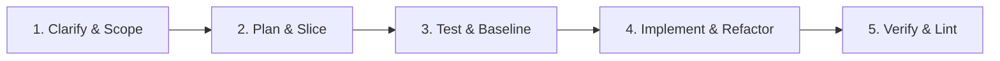

# AGENTS.md — DisciplineOS

Welcome to **DisciplineOS**. This workspace is governed by agile software engineering principles tailored for autonomous and pair-programming AI agents. All AI agents working in this repository must adhere to the workflows, engineering standards, and quality gates outlined below.

---

## 1. Core Agile Engineering Principles

1. **Working Software Over Speculative Architecture (YAGNI):** Implement only what is required for the immediate task or user story. Avoid speculative abstractions, unnecessary dependencies, and premature optimizations.
2. **Vertical Slices Over Horizontal Layers:** Deliver complete, end-to-end increments (Data $\to$ Domain Logic $\to$ Interface/API) in manageable chunks rather than partially working mass changes across entire layers.
3. **Fast Feedback & Test-Driven Verification (TDD):** Every increment must be verifiable. Write or update tests before or alongside code. Ensure a clean test baseline before declaring any task complete.
4. **Active Clarification:** If a requirement, API contract, or design decision is ambiguous or underspecified, stop and ask clarifying questions instead of making assumptions.
5. **No Regressions & Zero Dead Code:** Never leave broken tests, unhandled edge cases, stubbed placeholder comments (`// TODO: implement later`), or orphan files.

---

## 2. Agent Agile Development Lifecycle

When tasked with implementing features, refactoring, or fixing bugs, follow this 5-stage iterative cycle:



### Stage 1: Clarify & Scope
- Review requirements and inspect existing codebase conventions.
- Define clear **Acceptance Criteria (AC)** for what "Done" means for the slice.
- Highlight any external dependencies, security implications, or breaking changes upfront.

### Stage 2: Plan & Slice (Low-Overhead)
- **Small Tasks (1–2 files, bug fixes):** Formulate a brief mental or inline checklist and execute directly.
- **Complex Features / Refactors:** Outline a concise step-by-step plan (or trigger `/plan` / `/grill-me`) with distinct, testable phases.

### Stage 3: Test Baseline & TDD
- Run existing test suites to establish a known-good baseline before making modifications.
- Write failing unit/integration tests that capture the expected behavior of the new feature or bug fix.
- Verify tests fail for the right reason prior to implementation.

### Stage 4: Implement & Refactor
- Write clean, idiomatic, typed code satisfying the test criteria.
- Keep modifications minimal and focused on the target slice.
- Refactor for readability, modularity, and maintainability without altering proven behavior.

### Stage 5: Continuous Verification & Quality Gates
- Execute test suites, type-checkers, and linters.
- Verify zero compiler warnings, zero lint errors, and 100% passing tests on the modified slice.
- Perform a diff check to ensure no unintentional files, logs, or debug code leaked into the working tree.

---

## 3. Git & Commit Conventions

- **Atomic Commits:** Each commit should represent a single logical, working change.
- **Conventional Commits Format:**
  - `feat(<scope>): <description>` — New user-facing or system capabilities
  - `fix(<scope>): <description>` — Bug fixes and regression repairs
  - `refactor(<scope>): <description>` — Code changes that neither fix a bug nor add a feature
  - `test(<scope>): <description>` — Adding or updating test suites
  - `chore(<scope>): <description>` — Tooling, dependency updates, configuration
  - `docs(<scope>): <description>` — Documentation and spec updates
- **Branch / Worktree Isolation:** For experimental features or complex multi-agent tasks, work in isolated feature branches or git worktrees.

---

## 4. Token & Context Optimization (`rtk`)

When executing terminal commands, **always prefix shell commands with `rtk`** to minimize token overhead and keep agent context focused on high-signal output:

```bash
# Git
rtk git status          rtk git diff            rtk git log -n 5

# Files & Search
rtk ls <path>           rtk read <file>         rtk grep <pattern>

# Tests (filters to failures only)
rtk pytest tests/       rtk cargo test          rtk test <cmd>

# Build, Typecheck & Lint
rtk tsc                 rtk lint                rtk cargo build
rtk mypy                rtk ruff check          rtk prettier --check
```

*Note:* In command chains, prefix each segment: `rtk git add . && rtk git commit -m "feat: setup project baseline"`. For raw, unfiltered output during low-level debugging, use commands without `rtk`.

---

## 5. Repository Safety & Environment Rules

1. **Full Absolute Paths in Outputs:** Always output complete absolute paths (e.g. `/Users/dinesh/Documents/Projects/DiscplineOS/src/...`) in responses, session logs, and documentation to prevent ambiguity.
2. **Never Delete Documents / Data Without Explicit Approval:** Never delete, wipe, or bulk-remove `.pdf`, database files, or user documents during cleanup routines without explicit confirmation.
3. **Local Dependency Management:** Keep all package installs, virtual environments (`.venv`), node modules, and dependencies strictly local to this project root. Do not alter global environments.
